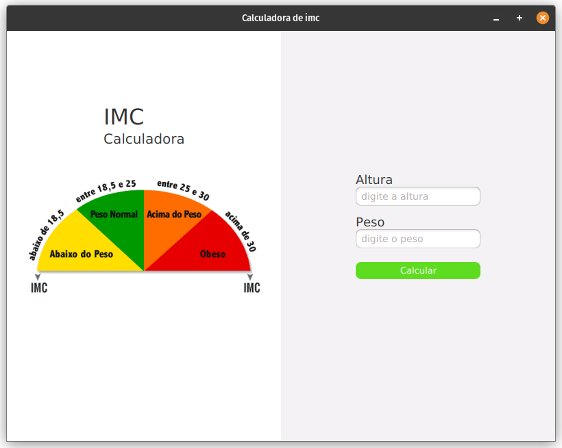

# Calculadora de IMC

[](https://openjdk.org/) []() []() []()

Uma aplicação desktop simples (Java + JavaFX) para calcular o **IMC (Índice de Massa Corporal)** criada com Scene Builder e o template JavaFX do IntelliJ.



---

## Demo rápida

* Insira **altura** (m) e **peso** (kg).
* Aceita **vírgula** ou **ponto** como separador decimal (ex.: `1,75` ou `1.75`).
* Clique em **Calcular** para ver o resultado e a classificação (Abaixo do peso, Peso normal, etc).

---

## Recursos / Destaques

* Interface feita no **Scene Builder** (FXML).
* Java puro + JavaFX (sem frameworks extras).
* Tratamento simples de entrada (substitui `,` por `.`).
* Estrutura simples para estudo e extensão.

---

## Estrutura do projeto

```
CalculadoraImc/
├─ src/
│  ├─ main/
│  │  ├─ java/
│  │  │  └─ com/example/calculadoraimc/
│  │  │     ├─ Launcher.java
│  │  │     ├─ HelloApplication.java
│  │  │     └─ HelloController.java
│  │  └─ resources/
│  │     └─ com/example/calculadoraimc/
│  │        ├─ layout.fxml
│  │        └─ imc.gif
└─ README.md
```

---

## Principais arquivos (exemplos)

**Launcher.java**

```java
package com.example.calculadoraimc;

import javafx.application.Application;

public class Launcher {
    public static void main(String[] args) {
        Application.launch(HelloApplication.class, args);
    }
}
```

**HelloApplication.java**

```java
package com.example.calculadoraimc;

import javafx.application.Application;
import javafx.fxml.FXMLLoader;
import javafx.scene.Scene;
import javafx.stage.Stage;

import java.io.IOException;

public class HelloApplication extends Application {
    @Override
    public void start(Stage stage) throws IOException {
        FXMLLoader fxmlLoader = new FXMLLoader(HelloApplication.class.getResource("layout.fxml"));
        Scene scene = new Scene(fxmlLoader.load(), 800, 600);
        stage.setTitle("Calculadora de imc");
        stage.setScene(scene);
        stage.show();
    }
}
```

**HelloController.java**

```java
package com.example.calculadoraimc;

import javafx.fxml.FXML;
import javafx.scene.control.Label;
import javafx.scene.control.TextField;

public class HelloController {
    @FXML private Label situacao;
    @FXML private Label resultadoIMC;
    @FXML private TextField altura;
    @FXML private TextField peso;

    @FXML
    public void calcularImc(){
        String textoAltura = altura.getText().replace(",", ".");
        String textoPeso   = peso.getText().replace(",", ".");

        try {
            double pes = Double.parseDouble(textoPeso);
            double alt = Double.parseDouble(textoAltura);
            double res = pes / (alt * alt);
            resultadoIMC.setText(String.format("%.2f", res));

            if (res < 18.5) {
                situacao.setText("Abaixo do peso!");
            } else if (res < 25) {
                situacao.setText("Peso normal");
            } else if (res < 30) {
                situacao.setText("Acima do peso");
            } else {
                situacao.setText("Obesidade!");
            }
        } catch (Exception e) {
            situacao.setText("Digite valores válidos!");
        }
    }
}
```

---

## Como executar

### IntelliJ (recomendado)

1. Importe o projeto como **Maven** ou **Gradle** (se aplicável) ou abra como projeto Java normal.
2. Verifique as configurações de **Module SDK** (Java 22) e as dependências do **JavaFX**.
3. Execute `Launcher.main()` (ou `HelloApplication`) pelo run do IntelliJ.

