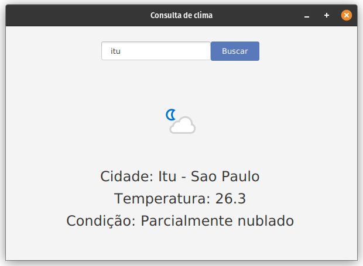

# 🌦️ Consulta de Clima — Java + JavaFX

[](https://openjdk.org/)
[]()
[](https://www.weatherapi.com/)
[]()
[]()

Um projeto em **Java + JavaFX** que permite consultar o **clima atual de qualquer cidade em tempo real**, utilizando a **WeatherAPI**.
Interface construída com **FXML (Scene Builder)** e estilizada via **CSS**, exibindo temperatura, condição e ícone oficial fornecido pela API.



---

## 🌤️ Demonstração rápida

* Busca o **clima atual** digitando o nome de qualquer cidade.
* Exibe **temperatura**, **condição**, **região** e **nome da cidade**.
* Carrega automaticamente o **ícone oficial do clima**.
* Atualiza a interface com **JavaFX + FXML**.
* Faz requisições externas usando `HttpClient`.

---

## ✨ Recursos / Destaques do Projeto

* Consumo de API REST utilizando `HttpClient` (Java 11+).
* Parse de JSON com a dependência oficial **org.json**.
* Uso de `.env` com a biblioteca **java-dotenv** para proteger a API_KEY.
* Interface organizada em FXML, sem código de layout em Java.
* Atualização de elementos JavaFX com `Platform.runLater`.
* Extração dinâmica do ícone da condição climática.
* Código limpo, ideal para estudo de:

  * JavaFX
  * FXML
  * Consumo de APIs REST
  * Variáveis de ambiente
  * Threads e atualização de UI

---

## 🧠 Tecnologias e Conceitos Aplicados

| Conceito / Tecnologia          | Descrição                                        |
| ------------------------------ | ------------------------------------------------ |
| **JavaFX 22**                  | Interface gráfica moderna.                       |
| **FXML**                       | Layout estruturado visualmente no Scene Builder. |
| **WeatherAPI**                 | Fonte oficial dos dados de clima.                |
| **java.net.http.HttpClient**   | Faz requisições HTTP não bloqueantes.            |
| **org.json**                   | Manipulação de JSON retornado pela API.          |
| **java-dotenv**                | Armazena a API_KEY de forma segura.              |
| **Thread + Platform.runLater** | Atualização da UI sem travar a aplicação.        |
| **ImageView**                  | Exibe ícone de condição climática.               |

---

## 🧱 Estrutura do Projeto

```
Clima/
├─ src/
│  ├─ main/
│  │  ├─ java/
│  │  │  └─ org/example/clima/
│  │  │     ├─ Launcher.java
│  │  │     ├─ HelloApplication.java
│  │  │     ├─ HelloController.java
│  │  │     └─ Api/
│  │  │        └─ ApiClient.java
│  │  └─ resources/
│  │     └─ org/example/clima/
│  │        ├─ hello-view.fxml
│  │        └─ style.css
├─ .env
└─ README.md
```

---

## 🌐 Principais Arquivos

### **Launcher.java**

```java
package org.example.clima;

import javafx.application.Application;

public class Launcher {
    public static void main(String[] args) {
        Application.launch(HelloApplication.class, args);
    }
}
```

---

### **HelloApplication.java**

```java
package org.example.clima;

import javafx.fxml.FXMLLoader;
import javafx.scene.Scene;
import javafx.stage.Stage;

public class HelloApplication extends javafx.application.Application {
    @Override
    public void start(Stage stage) throws IOException {
        FXMLLoader loader = new FXMLLoader(HelloApplication.class.getResource("hello-view.fxml"));
        Scene scene = new Scene(loader.load(), 600, 400);
        stage.setTitle("Consulta de Clima");
        stage.setScene(scene);
        stage.show();
    }
}
```

---

### **HelloController.java**

```java
package org.example.clima;

import io.github.cdimascio.dotenv.Dotenv;
import javafx.application.Platform;
import javafx.fxml.FXML;
import javafx.scene.control.Label;
import javafx.scene.control.TextField;
import javafx.scene.image.Image;
import javafx.scene.image.ImageView;
import org.json.JSONObject;

public class HelloController {
    private final String API_KEY = Env.get("API_KEY");

    @FXML private Label resCidade;
    @FXML private Label resTemp;
    @FXML private Label resCond;
    @FXML private TextField searchName;
    @FXML private ImageView img;

    @FXML
    protected void searchButton() {
        String cidade = searchName.getText().trim();
        if (cidade.isEmpty()) {
            resCidade.setText("Digite uma cidade");
            return;
        }

        new Thread(() -> {
            try {
                String url = "https://api.weatherapi.com/v1/current.json?key="
                        + API_KEY + "&q=" + cidade + "&lang=pt";

                String jsonStr = ApiClient.get(url);
                JSONObject json = new JSONObject(jsonStr);

                String nomeCidade = json.getJSONObject("location").getString("name");
                String regiao = json.getJSONObject("location").getString("region");
                String temp = json.getJSONObject("current").get("temp_c").toString();
                String condicao = json.getJSONObject("current").getJSONObject("condition").getString("text");
                String icon = json.getJSONObject("current").getJSONObject("condition").getString("icon");

                Platform.runLater(() -> {
                    resCidade.setText("Cidade: " + nomeCidade + " - " + regiao);
                    resCond.setText("Condição: " + condicao);
                    resTemp.setText("Temperatura: " + temp);
                    img.setImage(new Image("https:" + icon));
                });

            } catch (Exception e) {
                Platform.runLater(() -> resCidade.setText("Erro ao buscar dados"));
            }
        }).start();
    }
}
```

---

## 🌍 Conexão com API — ApiClient.java

```java
package org.example.clima.Api;

import java.net.URI;
import java.net.http.HttpClient;
import java.net.http.HttpRequest;
import java.net.http.HttpResponse;

public class ApiClient {

    public static String get(String url) throws Exception {
        HttpClient client = HttpClient.newHttpClient();

        HttpRequest request = HttpRequest.newBuilder()
                .uri(URI.create(url))
                .GET()
                .build();

        return client.send(request, HttpResponse.BodyHandlers.ofString())
                .body();
    }
}
```

---

## 🔐 Segurança com `.env`

Este projeto utiliza a biblioteca **java-dotenv** para manter sua API_KEY segura.

Arquivo `.env`:

```
API_KEY=SUAS_CHAVE_AQUI
```

Classe de acesso:

```java
class Env {
    private static final Dotenv dotenv = Dotenv.load();
    public static String get(String key) { return dotenv.get(key); }
}
```

> ✔ Isso evita expor sua chave da WeatherAPI no GitHub.

---

## 🚀 Como executar

### 🛠️ Requisitos

* Java **22**
* Maven
* JavaFX 22 (o Maven plugin já resolve tudo)

### ▶️ Executar

```
mvn clean javafx:run
```

Ou pelo IntelliJ:

1. Abra o projeto.
2. Rode `Launcher.java`.
3. A interface abrirá imediatamente.

---

## 📘 O que aprendi com este projeto

✔ Como consumir APIs REST em Java (HttpClient)

✔ Como trabalhar com JSON usando org.json

✔ Como proteger chaves sensíveis com `.env`

✔ Como atualizar a interface JavaFX usando Threads e Platform.runLater

✔ Como carregar imagens externas em ImageView

✔ Como estruturar projetos JavaFX com FXML
