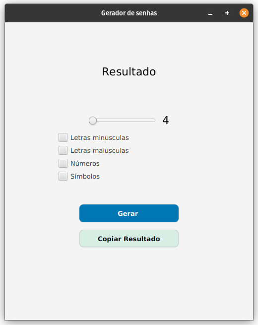

# 🔐 Gerador de Senhas

[](https://openjdk.org/) []() []() []()

Um pequeno projeto em **Java + JavaFX** que gera **senhas aleatórias seguras**, personalizáveis conforme o usuário escolhe letras maiúsculas, minúsculas, números e símbolos.
Interface construída com o **Scene Builder** e estilizada via **CSS**.



---

## 🧩 Demonstração rápida

* Gera uma **senha aleatória segura** com base nas opções selecionadas.
* Permite ajustar o **tamanho da senha** através de um **slider interativo**.
* Permite **copiar a senha gerada** para a área de transferência com um clique.
* Interface desenvolvida no **Scene Builder** com estilos aplicados via **CSS**.
* Utiliza a classe `SecureRandom` para gerar valores verdadeiramente aleatórios.

---

## ✨ Recursos / Destaques

* Interface 100% FXML (sem código de layout em Java).
* CSS externo com efeitos de hover nos botões.
* Atualização dinâmica do valor do slider.
* Geração de senhas com **caracteres configuráveis**.
* Função de **copiar senha** integrada ao clipboard do sistema.
* Código limpo, ideal para estudo de **JavaFX**, **FXML** e **SecureRandom**.

---

## 🧠 Tecnologias e Conceitos Aplicados

| Conceito          | Descrição                                                  |
| ----------------- | ---------------------------------------------------------- |
| **FXML**          | Define a interface de forma declarativa.                   |
| **Scene Builder** | Criação visual da interface.                               |
| **SecureRandom**  | Geração de números aleatórios com segurança criptográfica. |
| **Clipboard API** | Copia texto para o clipboard do sistema.                   |
| **Listeners**     | Atualizam o texto do slider em tempo real.                 |
| **CSS JavaFX**    | Define o estilo visual e efeitos de hover.                 |

---

## 🧱 Estrutura do projeto

```
GeradorSenhas/
├─ src/
│  ├─ main/
│  │  ├─ java/
│  │  │  └─ com/example/geradorsenhas/
│  │  │     ├─ Launcher.java
│  │  │     ├─ Application.java
│  │  │     └─ Controller.java
│  │  └─ resources/
│  │     └─ com/example/geradorsenhas/
│  │        ├─ layout.fxml
│  │        └─ style.css
└─ README.md
```

---

## 📂 Principais arquivos

### **Launcher.java**

```java
package com.example.geradorsenhas;

public class Launcher {
    public static void main(String[] args) {
        javafx.application.Application.launch(Application.class, args);
    }
}
```

---

### **Application.java**

```java
package com.example.geradorsenhas;

import javafx.fxml.FXMLLoader;
import javafx.scene.Scene;
import javafx.stage.Stage;
import java.io.IOException;

public class Application extends javafx.application.Application {
    @Override
    public void start(Stage stage) throws IOException {
        FXMLLoader fxmlLoader = new FXMLLoader(Application.class.getResource("layout.fxml"));
        Scene scene = new Scene(fxmlLoader.load(), 500, 600);
        stage.setTitle("Gerador de Senhas");
        stage.setScene(scene);
        stage.show();
    }
}
```

---

### **Controller.java**

```java
package com.example.geradorsenhas;

import javafx.fxml.FXML;
import javafx.scene.control.CheckBox;
import javafx.scene.control.Slider;
import javafx.scene.input.Clipboard;
import javafx.scene.input.ClipboardContent;
import javafx.scene.text.Text;
import java.security.SecureRandom;

public class Controller {
    @FXML private Text resultadoText;
    @FXML private Slider slider;
    @FXML private Text sliderRes;
    @FXML private CheckBox minusculas;
    @FXML private CheckBox maiusculas;
    @FXML private CheckBox numeros;
    @FXML private CheckBox especiais;

    private final SecureRandom random = new SecureRandom();

    @FXML
    protected void gerarSenha() {
        StringBuilder conjunto = new StringBuilder();

        if (minusculas.isSelected()) conjunto.append("abcdefghijklmnopqrstuvwxyz");
        if (maiusculas.isSelected()) conjunto.append("ABCDEFGHIJKLMNOPQRSTUVWXYZ");
        if (numeros.isSelected()) conjunto.append("0123456789");
        if (especiais.isSelected()) conjunto.append("!@#$%^&*()_+");

        if (conjunto.isEmpty()) {
            resultadoText.setText("Selecione ao menos uma opção!");
            return;
        }

        int tamanho = (int) slider.getValue();
        sliderRes.setText(String.valueOf(tamanho));

        StringBuilder senhaGerada = new StringBuilder();
        for (int i = 0; i < tamanho; i++) {
            int index = random.nextInt(conjunto.length());
            senhaGerada.append(conjunto.charAt(index));
        }

        resultadoText.setText(senhaGerada.toString());
    }

    @FXML
    protected void copiarSenha() {
        String texto = resultadoText.getText();
        if (texto == null || texto.isEmpty()) {
            System.out.println("Nada para copiar!");
            return;
        }

        ClipboardContent content = new ClipboardContent();
        content.putString(texto);
        Clipboard.getSystemClipboard().setContent(content);

        System.out.println("Copiado: " + texto);
    }

    @FXML
    protected void initialize() {
        slider.valueProperty().addListener((obs, oldVal, newVal) ->
            sliderRes.setText(String.valueOf(newVal.intValue()))
        );
    }
}
```

---

## 🎨 Interface (FXML)

Criada inteiramente com o **Scene Builder**, o layout contém:

* Campo de resultado (`Text`)
* Slider para definir o tamanho da senha
* CheckBoxes para selecionar os tipos de caracteres
* Botões para **gerar** e **copiar** a senha

Arquivo principal: `layout.fxml`

---

## 🧵 Estilos (style.css)

```css
#buttonGerar {
    -fx-background-color: #0077b3;
    -fx-text-fill: white;
    -fx-font-weight: bold;
    -fx-background-radius: 8;
    -fx-cursor: hand;
}
#buttonGerar:hover {
    -fx-background-color: #333;
}

#buttonCopiar {
    -fx-background-color: #4CAF50;
    -fx-text-fill: white;
    -fx-font-weight: bold;
    -fx-background-radius: 8;
    -fx-cursor: hand;
}
#buttonCopiar:hover {
    -fx-background-color: #2e7d32;
}
```

---

## 🚀 Como executar

### 💻 IntelliJ IDEA (recomendado)

1. Abra o projeto no IntelliJ como **projeto Java normal**.
2. Certifique-se de que o **JavaFX SDK** está configurado (ex.: `/opt/javafx/lib`).
3. Configure as opções da JVM, se necessário:

   ```
   --module-path /opt/javafx/lib --add-modules javafx.controls,javafx.fxml
   ```
4. Execute o arquivo `Launcher.java`.
5. A aplicação abrirá mostrando a interface do **Gerador de Senhas**.
