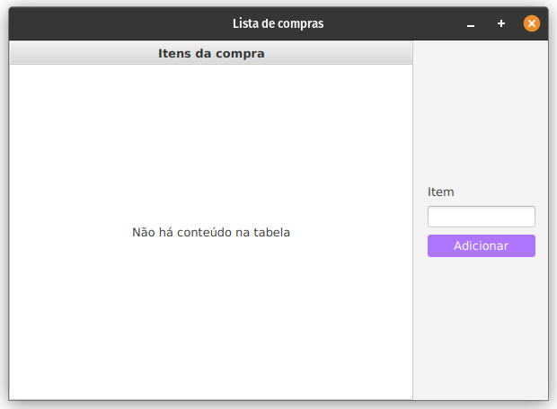

# 🛒 Lista de Compras

[](https://openjdk.org/) []() []() []()

Um pequeno projeto em **Java + JavaFX** que permite criar uma **lista de compras simples**, adicionando itens e exibindo tudo em uma **TableView** funcional.
O layout é construído com **FXML** e organizado pelo **Scene Builder**.



---

## 🧩 Demonstração rápida

* Adiciona itens digitados pelo usuário diretamente na tabela.
* Atualiza a lista em tempo real usando `ObservableList`.
* Interface simples e limpa construída com **Scene Builder + FXML**.
* Ideal para estudo de **TableView**, **FXML**, **Controllers** e **JavaFX básico**.

---

## ✨ Recursos / Destaques

* Interface 100% em FXML (nada de layout via Java).
* Atualização automática da tabela com `ObservableList`.
* Projeto minimalista para entender:

  * `TableView`
  * `TableColumn`
  * `TextField`
  * `FXML Loader`
  * Ciclo `initialize()` no controller
---

## 🧠 Tecnologias e Conceitos Aplicados

| Conceito               | Descrição                                        |
| ---------------------- | ------------------------------------------------ |
| **FXML**               | Interface declarativa dividida da lógica.        |
| **Scene Builder**      | Ferramenta visual para montar layouts JavaFX.    |
| **TableView**          | Exibe listas e tabelas dinâmicas.                |
| **ObservableList**     | Lista reativa que atualiza a UI automaticamente. |
| **Controller (MVC)**   | Organiza comportamentos desacoplados do layout.  |
| **JavaFX Application** | Estrutura o ciclo de vida da aplicação.          |

---

## 🧱 Estrutura do projeto

```
ListaDeCompras/
├─ src/
│  ├─ main/
│  │  ├─ java/
│  │  │  └─ org/example/listadecompras/
│  │  │     ├─ Launcher.java
│  │  │     ├─ HelloApplication.java
│  │  │     └─ HelloController.java
│  │  └─ resources/
│  │     └─ org/example/listadecompras/
│  │        └─ layout.fxml
│  │        └─ style.css
└─ README.md
```

---

## 📂 Principais arquivos

### **Launcher.java**

```java
package org.example.listadecompras;

import javafx.application.Application;

public class Launcher {
    public static void main(String[] args) {
        Application.launch(HelloApplication.class, args);
    }
}
```

---

### **HelloApplication.java**

```java
package org.example.listadecompras;

import javafx.application.Application;
import javafx.fxml.FXMLLoader;
import javafx.scene.Scene;
import javafx.stage.Stage;

import java.io.IOException;

public class HelloApplication extends Application {
    @Override
    public void start(Stage stage) throws IOException {
        FXMLLoader fxmlLoader = new FXMLLoader(HelloApplication.class.getResource("layout.fxml"));
        Scene scene = new Scene(fxmlLoader.load(), 600, 400);
        stage.setTitle("Lista de compras");
        stage.setScene(scene);
        stage.show();
    }
}
```

---

### **HelloController.java**

```java
package org.example.listadecompras;

import javafx.beans.property.SimpleStringProperty;
import javafx.collections.FXCollections;
import javafx.collections.ObservableList;
import javafx.fxml.FXML;
import javafx.scene.control.TableColumn;
import javafx.scene.control.TableView;
import javafx.scene.control.TextField;

public class HelloController {

    private final ObservableList<String> itens = FXCollections.observableArrayList();

    @FXML
    private TableColumn<String, String> tableListaItens;

    @FXML
    private TableView<String> tabelaItens;

    @FXML
    private TextField itemInput;

    @FXML
    protected void initialize() {
        tableListaItens.setCellValueFactory(data ->
                new SimpleStringProperty(data.getValue()));
        tabelaItens.setItems(itens);
    }

    @FXML
    protected void adicionarCompra() {
        String novoItem = itemInput.getText();
        if (novoItem.isEmpty()) return;

        itens.add(novoItem);
        itemInput.clear();
    }
}
```

---

## 🎨 Interface (FXML)

A interface contém:

* Um campo de texto (`TextField`) para digitar o item
* Um botão para adicionar o item à lista
* Uma `TableView` exibindo todos os itens adicionados
* Uma única coluna (`TableColumn`) mostrando cada entrada

Arquivo principal: **layout.fxml**

---

## 🚀 Como executar

### 💻 IntelliJ IDEA (recomendado)

1. Abra o projeto como um projeto Java normal.

2. Configure o JavaFX (caso necessário):

   ```
   --module-path /opt/javafx/lib --add-modules javafx.controls,javafx.fxml
   ```

3. Execute o arquivo `Launcher.java`.

4. A aplicação será aberta mostrando sua **Lista de Compras**.
