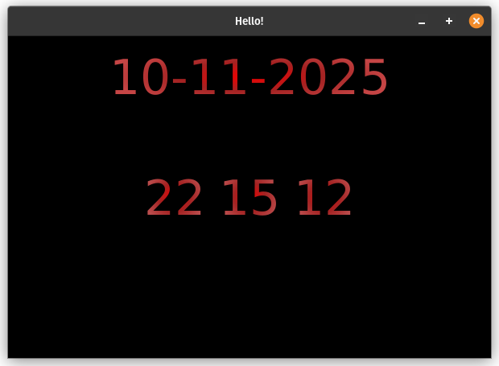

# ⏰ Relógio Digital

[](https://openjdk.org/) []() []() []()

Um pequeno projeto em **Java + JavaFX** que exibe a **data e hora atualizadas em tempo real**, com interface criada no **Scene Builder**.



---

## 🕹️ Demo rápida

* Mostra a **data atual** (formato `dd-MM-yyyy`).
* Atualiza **horas, minutos e segundos** automaticamente a cada segundo.
* Interface construída com o **Scene Builder** e o **template JavaFX padrão do IntelliJ**.
* Ideal para estudo de **Timeline**, **FXML**, e **atualização de interface com JavaFX**.

---

## ✨ Recursos / Destaques

* UI criada 100% com FXML (sem código de layout no Java).
* Atualização em tempo real usando `Timeline` e `KeyFrame`.
* Código limpo e fácil de entender — ideal para quem está aprendendo JavaFX.
* Uso de `LocalDateTime` e `DateTimeFormatter` para formatação da data/hora.

---

## 🧩 Estrutura do projeto

```
RelogioDigital/
├─ src/
│  ├─ main/
│  │  ├─ java/
│  │  │  └─ com/example/relogiodigital/
│  │  │     ├─ Launcher.java
│  │  │     ├─ Application.java
│  │  │     └─ Controller.java
│  │  └─ resources/
│  │     └─ com/example/relogiodigital/
│  │        └─ layout.fxml
└─ README.md
```

---

## 📂 Principais arquivos

### **Launcher.java**

```java
package com.example.relogiodigital;

public class Launcher {
    public static void main(String[] args) {
        javafx.application.Application.launch(Application.class, args);
    }
}
```

### **Application.java**

```java
package com.example.relogiodigital;

import javafx.fxml.FXMLLoader;
import javafx.scene.Scene;
import javafx.stage.Stage;
import java.io.IOException;

public class Application extends javafx.application.Application {
    @Override
    public void start(Stage stage) throws IOException {
        FXMLLoader fxmlLoader = new FXMLLoader(Application.class.getResource("layout.fxml"));
        Scene scene = new Scene(fxmlLoader.load(), 600, 400);
        stage.setTitle("Relógio Digital");
        stage.setScene(scene);
        stage.show();
    }
}
```

### **Controller.java**

```java
package com.example.relogiodigital;

import javafx.animation.Animation;
import javafx.animation.KeyFrame;
import javafx.animation.Timeline;
import javafx.fxml.FXML;
import javafx.scene.control.Label;
import javafx.util.Duration;
import java.time.LocalDateTime;
import java.time.format.DateTimeFormatter;

public class Controller {
    @FXML private Label dateLabel;
    @FXML private Label hourLabel;
    @FXML private Label minuteLabel;
    @FXML private Label secondLabel;

    @FXML
    public void initialize() {
        // Exibe a data atual
        LocalDateTime now = LocalDateTime.now();
        DateTimeFormatter formatter = DateTimeFormatter.ofPattern("dd-MM-yyyy");
        dateLabel.setText(now.format(formatter));

        // Atualiza o relógio a cada segundo
        Timeline clock = new Timeline(
            new KeyFrame(Duration.seconds(0), e -> {
                LocalDateTime currentTime = LocalDateTime.now();
                hourLabel.setText(String.format("%02d", currentTime.getHour()));
                minuteLabel.setText(String.format("%02d", currentTime.getMinute()));
                secondLabel.setText(String.format("%02d", currentTime.getSecond()));
            }),
            new KeyFrame(Duration.seconds(1))
        );

        clock.setCycleCount(Animation.INDEFINITE);
        clock.play();
    }
}
```

---

## 🧠 Conceitos aplicados

* **`FXML`**: separação de interface e lógica.
* **`Timeline` e `KeyFrame`**: atualização contínua da UI.
* **`LocalDateTime`**: manipulação de tempo atual.
* **`String.format()`**: formatação para sempre exibir dois dígitos (`09`, `04`, etc).

---

## 🚀 Como executar

### 💻 IntelliJ IDEA (recomendado)

1. Abra o projeto no IntelliJ como **projeto Java normal**.
2. Certifique-se de que o **JavaFX SDK** está configurado (ex.: `/opt/javafx/lib`).
3. Configure as VM Options se necessário:

   ```
   --module-path /opt/javafx/lib --add-modules javafx.controls,javafx.fxml
   ```
4. Execute o arquivo `Launcher.java`.

---
